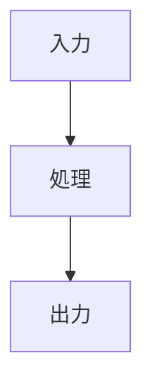

DESIGN.md を作成・更新する。SPEC.md の要件を受けて、技術アーキテクチャ・データ構造・実装ガイドを記述する。

## いつ使うか

- SPEC.md が承認された後、実装前の技術設計を文書化するとき
- アーキテクチャの判断・技術選択の根拠を残したいとき
- TASK.md 作成前に設計を確定させたいとき
- 既存 DESIGN.md を改訂するとき（`/sdd-design <feature-name> update`）

## 実行手順

### 1. SPEC.md を読み込む

`specs/<feature-name>/SPEC.md` を読み込み、以下を把握する:
- 全 REQ とその AC
- 主要 definitions
- スコープ外の境界

### 2. ファイル作成

`specs/<feature-name>/DESIGN.md` を以下の構造で作成する:

```markdown
---
id: <feature-name>
version: 0.1.0
spec_version: <参照した SPEC のバージョン>
title: <タイトル> — 技術設計
created_at: <YYYY-MM-DD>
type: design
---

# <タイトル> — 技術設計

- **SPEC**: <feature-name>@<spec_version>
- **rev**: 1

## 全体アーキテクチャ

<コンポーネント構成・処理の流れを記述する。mermaid 図を積極的に使う>



## データ構造・スキーマ

<クラス・型定義・YAML/JSONスキーマ・DB テーブル等を記述する>

## 処理フロー詳細

<主要なユースケースのシーケンスを記述する>

## 技術判断・設計根拠

| 判断 | 選択 | 理由 |
|---|---|---|
| <設計上の選択点> | <採用した選択> | <理由> |

## 実装ガイド

<各 REQ に対応する実装の具体的な指針・コード断片>

### REQ-001 の実装

<コード例・ライブラリ使用方針等>

## 未解決事項（Open Decisions）

| ID | 内容 | 候補 | 現時点の方針 |
|---|---|---|---|
| O-1 | <未確定の設計判断> | <選択肢> | <暫定方針> |
```

### 3. 記述のルール

- **REQ への参照を明示**する。各セクション・設計判断は「REQ-NNN を実現するための設計」と紐付ける
- **コード断片は TASK の実装ガイドになる**ことを意識して具体的に書く
- **「なぜその選択か」を必ず残す**。将来の改修者（AIを含む）がトレードオフを理解できるように
- **mermaid 図を積極活用**する。フロー・シーケンス・ER 図等

### 4. SPEC との整合性確認

DESIGN 作成後、以下を確認する:
- 全 REQ が DESIGN のどこかに対応しているか
- DESIGN で追加した技術要件が SPEC のスコープ外を侵害していないか
- Open Decisions が SPEC の未決事項と整合しているか

### 5. DESIGN.yml の作成

```yaml
id: <feature-name>
spec_version: <参照 SPEC バージョン>
rev: 1
open_decisions:
  - id: O-1
    title: <未解決事項>
    current_lean: <暫定方針>
```
