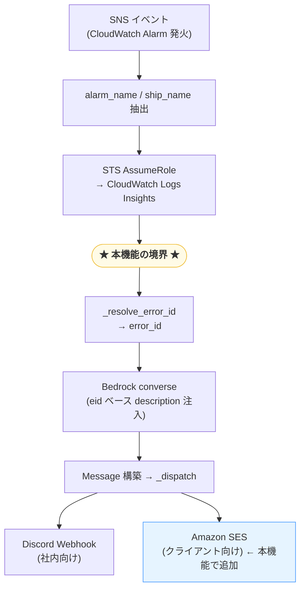
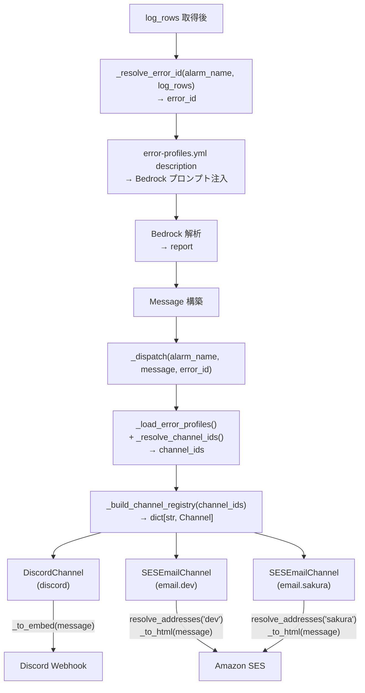

# S3データ不着検知時のクライアントへのメール通知 — 技術設計

- **SPEC**: client-email-notification@0.5.0
- **rev**: 4

## システム全体における位置づけ

Reporter Lambda（AWSAlarmReport）は SNS 経由で CloudWatch Alarm を受け取り、クライアントアカウントのログを取得し、Bedrock で解析した結果を通知する。
本機能が対象とするのは**Logs Insights クエリ完了後（log_rows 取得後）から通知送信まで**であり、error_id 決定・Bedrock プロンプト注入・通知ディスパッチを含む。



### 現状の境界（変更前）

Bedrock 解析が成功すると、`main()` は `report` dict を直接参照して Discord embed を構築・送信する。通知先は Discord のみ、かつ通知ロジックが `main()` に直書きされている。

```
[Bedrock 解析結果]
  report: dict          ← Bedrock JSON を _normalize_report() した生の辞書
  alarm_name: str
  ship_name: str
  center: datetime      ← Alarm 発火時刻
  log_rows: list        ← Insights ログ（件数表示用）
  log_group: str        ← deeplink 生成用
    │
    ▼ main.py lines 723–769（直書き）
  DiscordWebhook + DiscordEmbed を組み立てて webhook.execute()
    │
    ▼
  Discord のみに送信
```

### あるべき境界（変更後）

log_rows 取得後から通知送信までを本機能が担う。`_resolve_error_id` で error_id を確定してから Bedrock を呼び出し、結果を `Message` に変換して `_dispatch()` に渡す。通知先・通知フォーマットはすべて `_dispatch()` 内部に閉じ、`main()` は通知の詳細を知らない。

```
[Logs Insights クエリ完了]
  alarm_name: str
  log_rows: list   ← error_id 判定に使用
    │
    ▼ _resolve_error_id(alarm_name, log_rows) → error_id
    ▼ error-profiles.yml の description（error_id キー）→ Bedrock プロンプトに注入
    ▼ Bedrock 解析 → report: dict
    │
    ▼ Message 構築（report → Message フィールドマッピング）
  Message(
    title      = report["summary"],
    severity   = report["severity"],
    confidence = report["confidence"],
    root_cause = report["root_cause_hypothesis"],
    actions    = report["suggested_actions"],
    alarm_name = alarm_name,
    ship_name  = ship_name,
    timestamp  = center,          ← log_rows / log_group / deeplinks は含めない
  )
    │
    ▼ _dispatch(alarm_name, message, error_id)
  error-profiles.yml を引き → channel_ids を解決
  email.yaml を引き → SESEmailChannel ごとのアドレスリストを解決
    │
    ├─→ DiscordChannel.send(message)   → Discord Webhook（社内）
    └─→ SESEmailChannel.send(message)  → Amazon SES（クライアント）
```

`log_rows`（件数）・`log_group`（deeplinks）は Discord 固有の表示情報のため `Message` に含めない。移行後は現行 embed にあった「件数」「集計時間窓」「詳細リンク」は出力されなくなる（将来必要なら `DiscordChannel` 固有の拡張として対応する）。

`_post_minimal_embed`（エラーフォールバック）と `_post_prompt_attachment`（デバッグ添付）は本機能のスコープ外であり、引き続き Discord 直結で動作する。

## 全体アーキテクチャ（本機能内）

既存の Discord 送信を `DiscordChannel` に収め、`SESEmailChannel` を並列に追加する。
両者は `Channel` 抽象クラスを実装し、同一インターフェースで dispatch される。



bedrock-prompt-generalization とは独立した設計とする。

**前回設計からの主な差分**:

> **変更の動機**: 旧設計では error_id はチャネルルーティングの鍵としてのみ使われており、LLM への入力はエラー種別によらず同一だった。「ログはあるがエラーなし」のケースを `lambda_failure` と誤分類する問題もあった。これらを解消するため、error_id の確定を Bedrock 呼び出し前に行い、種別ごとの文脈説明をプロンプトに注入する設計に改めた。

| 変更点 | 前回（rev 3） | 現在（rev 4） |
|---|---|---|
| `_resolve_error_id` の判定ロジック | log_rows 件数のみで2分岐 | alarm_name パターン + log status フィールド内容で4分岐 |
| `unknown_alarm` | なし | alarm_name が `hdw-*` パターン外のケースとして追加 |
| error_id の用途 | チャネルルーティングのみ | チャネルルーティング + Bedrock プロンプト注入（description） |
| 設定ファイル | `error-routing.yml`（channels のみ） | `error-profiles.yml`（channels + description 統合・改名） |
| DESIGN の境界説明 | 「Bedrock 完了後」（実態と不一致） | 「Logs Insights 完了後」に修正（`_resolve_error_id` の呼び出し位置は rev 3 から変わっていない） |

## データ構造・スキーマ

### Message 型（チャネル非依存）

```python
# src/channels/message.py
from dataclasses import dataclass
from datetime import datetime

@dataclass(frozen=True)
class Message:
    title: str           # Bedrock summary（60字以内）
    severity: str        # HIGH / MEDIUM / LOW
    confidence: str      # high / medium / low
    root_cause: str      # root_cause_hypothesis
    actions: list[str]   # suggested_actions
    alarm_name: str
    ship_name: str
    timestamp: datetime
```

`Message` は Discord にも email にも依存しない。各チャネルが `send()` 内部で自フォーマットに変換する。

### Channel インターフェース

```python
# src/channels/base.py
from abc import ABC, abstractmethod
from src.channels.message import Message

class Channel(ABC):
    @property
    @abstractmethod
    def id(self) -> str: ...

    @abstractmethod
    def send(self, message: Message) -> None: ...
```

### チャネル一覧

| id | クラス | 接続情報の取得元 |
|---|---|---|
| `discord` | `DiscordChannel` | `DISCORD_WEBHOOK_URL` env var（既存） |
| `email.<group_id>` | `SESEmailChannel` | `config/email.yaml` の `<group_id>` キー |

`email.<group_id>` は `error-profiles.yml` の channels に記述する（例: `email.dev`、`email.sakura`）。
`_build_channel_registry` が channel_ids を受け取り、`email.*` を動的にパースして `SESEmailChannel` インスタンスを生成する。

### `config/error-profiles.yml` スキーマ

チャネルルーティングと Bedrock プロンプト補足説明を一体で管理する。
`channels` は通知先、`description` は Bedrock に注入するエラー種別の文脈説明。

> **旧設計との差分**: 旧設計では `error-routing.yml` としてチャネルルーティングのみを管理していた。本機能で「error_id ごとに Bedrock プロンプトへ文脈説明を注入する」アイデアを追加し、`description` フィールドを同ファイルに統合して `error-profiles.yml` に改名した。

```yaml
- id: s3_data_missing
  channels:
    - discord
    - email.dev
    - email.sakura
  description: |
    S3へのデータ不着を検知しました。対象Lambdaの実行ログが存在しないため、Lambda自体が起動していません。
    原因として、クライアント側のアップロード失敗またはイベントトリガー設定の不備が考えられます。

- id: lambda_failure
  channels:
    - discord
    - email.dev
    - email.sakura
  description: |
    対象Lambdaが起動しましたが、処理中にエラーが発生しました。
    CloudWatch Logsにstatus=errorのログが記録されています。
    原因として、入力データの形式不正、依存サービスのタイムアウト、またはコードのバグが考えられます。

- id: unknown
  channels:
    - discord
  description: |
    エラー種別を特定できませんでした。Lambdaの実行ログは存在しますが、エラーログが含まれていません。
    手動での調査が必要です。

- id: unknown_alarm
  channels:
    - discord
  description: |
    想定外のアラーム名を受信しました。このシステムが処理対象としていないアラームが発火した可能性があります。
    アラーム設定・命名規則を確認してください。
```

`id` をキーに辞書化して引く。`description` は `entry.get("description", "")` で取得し Bedrock プロンプトに注入する。`id` 不在の場合は discord のみにフォールバックし WARNING ログを出す。

---

### `config/email.yaml` スキーマ

リスト of dict 形式。`id` でグループを識別し `add` に送信先アドレスを列挙する。継承・override なし。

```yaml
- id: dev
  add:
    - alerts@scrumsign.com

- id: sakura
  add:
    - captain@sakura-shipping.com
    - ops@sakura-shipping.com
```

解決ロジック:

```python
def resolve_addresses(group_id: str, entries: list[dict]) -> list[str]:
    by_id = {e["id"]: e for e in entries}
    entry = by_id.get(group_id)
    if entry is None:
        logger.warning("email group %r not found in email.yaml", group_id)
        return []
    return list(entry.get("add", []))
```

group_id が存在しない場合は空リスト（送信スキップ）とし WARNING ログを出す。

## 処理フロー詳細

ログ件数にかかわらず Bedrock は常に呼び出し、`_dispatch` を経由して全登録チャネルへ通知する。

```
1. Insights クエリ完了（log_rows: 0 件 or N 件）
       ↓
2. _resolve_error_id(alarm_name, log_rows) → error_id
   - log_rows が空                           → "s3_data_missing"（Lambda 未起動 = S3 データ未着）
   - log_rows あり かつ status: error を含む  → "lambda_failure"（Lambda 起動・処理失敗）
   - log_rows あり かつ status: error を含まない → "unknown"（不明エラー）+ WARNING
   - hdw-* パターン外                         → "unknown_alarm"（想定外アラーム）+ WARNING
       ↓
3. Bedrock 解析（log_rows の内容 + error-profiles.yml の description（error_id に対応）を prompt に注入して呼び出す。log_rows が 0 件の場合も呼び出す）
       ↓
4. Message 構築（title / severity / confidence / root_cause / actions / alarm_name / ship_name / timestamp）
       ↓
5. _dispatch(alarm_name, message, error_id)
   → error-profiles.yml から error_id に対応する channels リストを取得
     error_id 不在 → ["discord"] にフォールバック + WARNING ログ
   → channel_ids から Channel インスタンスを生成
     （email.* は group_id を解析して SESEmailChannel を生成）
       ↓
6. 各 Channel.send(message) を順次実行
   例外が出ても catch して次のチャネルに進む（通知欠落を最小化）

6a. DiscordChannel.send(message)
    → 内部で Message → DiscordEmbed に変換して webhook 送信

6b. SESEmailChannel.send(message)
    送信先は eid と email.yaml の2段階で決まる:
      - eid → error-profiles.yml の channels → channel_id（例: "email.dev"）  ← Step 5 で確定済み
      - channel_id の group_id（例: "dev"）→ email.yaml の id = group_id → アドレスリスト
    → アドレスリストが空（group_id 不在）の場合は送信スキップ + WARNING ログ
    → 内部で Message → HTML に変換して SES 送信（全件一括）
```

## ルーティングアルゴリズム詳細

### Step 1: alarm_name + log_rows → error_id（`_resolve_error_id`）

`alarm_name` のパターンと `log_rows` の内容でエラー種別を4分岐で判定する。

> **旧設計との差分**: 旧設計では log_rows の件数（0件 or 非0件）のみで2分岐していた。本機能でログ内容（`status: error` の有無）を加えた4分岐に拡張し、Bedrock 呼び出し前に error_id を確定することでプロンプト注入を可能にした。

- alarm_name が `hdw-*` パターン外: 想定外アラーム → `"unknown_alarm"`
- ログ 0 件: Lambda 未起動 → `"s3_data_missing"`
- ログあり + `status: error`: Lambda 起動・処理失敗 → `"lambda_failure"`
- ログあり + `status: error` なし: 不明エラー → `"unknown"`

```python
def _resolve_error_id(alarm_name: str, log_rows: list) -> str:
    if not ALARM_NAME_RE.match(alarm_name):
        logger.warning("unknown alarm_name pattern %r", alarm_name)
        return "unknown_alarm"
    if not log_rows:
        return "s3_data_missing"
    if any(
        f.get("field") == "status" and f.get("value") == "error"
        for row in log_rows
        for f in row
    ):
        return "lambda_failure"
    logger.warning("logs exist but no error status found for alarm %r", alarm_name)
    return "unknown"
```

### Step 2: error_id → channel_ids（`_load_error_profiles`）

`config/error-profiles.yml` を読み込み、`{error_id: entry}` の辞書として返す。
呼び出し元で error_id をキーに引き、見つからなければ `["discord"]` にフォールバック。

```python
def _load_error_profiles() -> dict[str, dict]:
    path = Path(__file__).parent / "config" / "error-profiles.yml"
    entries: list[dict] = yaml.safe_load(path.read_text(encoding="utf-8"))
    return {e["id"]: e for e in entries}

def _resolve_channel_ids(error_id: str, routing: dict[str, dict]) -> list[str]:
    entry = routing.get(error_id)
    if entry is None:
        logger.warning(
            "error_id %r not found in error-profiles.yml, falling back to discord", error_id
        )
        return ["discord"]
    return entry["channels"]
```

### Step 3: channel_ids → Channel インスタンス + Dispatch（`_dispatch`）

`_dispatch` は `error_id` を受け取り、routing 解決 → レジストリ構築 → 全チャネル送信を担う。
`_resolve_error_id` は main.py 側で呼び、`error_id` を明示的に渡す設計とする。

`_build_channel_registry(channel_ids)` が channel_ids を受け取り動的にレジストリを構築する。
`discord` は固定、`email.<group_id>` は group_id を解析して `SESEmailChannel` を生成する。
未解決の channel_id はスキップ、`send()` の例外も catch して次チャネルに継続。

```python
def _dispatch(alarm_name: str, message: Message, error_id: str) -> None:
    routing     = _load_error_profiles()
    channel_ids = _resolve_channel_ids(error_id, routing)
    registry    = _build_channel_registry(channel_ids)

    for cid in channel_ids:
        channel = registry.get(cid)
        if channel is None:
            logger.warning("channel_id %r not in registry, skipping", cid)
            continue
        try:
            channel.send(message)
        except Exception:
            logger.warning("channel %r send failed", cid, exc_info=True)
            # 例外は再 raise しない — 次チャネルへ継続（AC-007-4 / AC-007-5）

def _build_channel_registry(channel_ids: list[str]) -> dict[str, Channel]:
    registry: dict[str, Channel] = {
        "discord": DiscordChannel(webhook_url=os.environ["DISCORD_WEBHOOK_URL"]),
    }
    for cid in channel_ids:
        if cid.startswith("email."):
            group_id = cid.split(".", 1)[1]
            registry[cid] = SESEmailChannel(group_id=group_id)
    return registry
```

### フォールバック挙動まとめ

| 状況 | 挙動 | ログ |
|---|---|---|
| alarm_name が `hdw-*` パターン外 | error_id = `"unknown_alarm"` | WARNING |
| log_rows が空 | error_id = `"s3_data_missing"` | — |
| log_rows あり かつ `status: error` を含む | error_id = `"lambda_failure"` | — |
| log_rows あり かつ `status: error` を含まない | error_id = `"unknown"` | WARNING |
| error_id が `error-profiles.yml` に不在 | channel_ids = `["discord"]` | WARNING |
| channel_id が `registry` に不在 | そのチャネルをスキップ | WARNING |
| `Channel.send()` が例外 | catch して次チャネルへ継続 | WARNING |
| 全段階正常 | 全 channel_ids に送信 | — |

## 技術判断・設計根拠

| 判断 | 選択 | 理由 |
|---|---|---|
| alarm → error_id マッピング | コード直書き | プロファイル非依存・シンプル・YAML 設定不要 |
| error_id 判定のタイミング | Bedrock 呼び出し前 | error_id に基づく description をプロンプトに注入するため、Bedrock より先に確定する必要がある |
| error_id 判定ロジック | log_rows の件数 + status フィールド内容で4分岐 | 旧 2 分岐（件数のみ）では「ログはあるがエラーなし」のケースを `lambda_failure` と誤分類していた |
| channels と description の統合 | `error-profiles.yml` 1ファイル | 旧 `error-routing.yml`（channels のみ）に description を追加。error_id 追加時に1ファイルだけ更新すれば済む |
| `send()` の引数型 | `Message`（チャネル非依存型） | Discord 依存をインターフェースから排除。各チャネルが内部で自フォーマットに変換する |
| メール宛先の管理 | `config/email.yaml` | バージョン管理・一覧性・変更の追跡が可能。env var より可読性が高い |
| メールサービス | Amazon SES | AWS ネイティブ・IAM ロールで認証・クライアント側の操作不要（RESEARCH-001.md 参照） |
| チャネル失敗時の挙動 | 他チャネルへの送信を継続 | 通知欠落を最小化する現行方針の踏襲 |

## 実装ガイド

### ディレクトリ構成

```
src/
└── channels/
    ├── __init__.py
    ├── message.py     — Message dataclass（チャネル非依存）
    ├── base.py        — Channel 抽象クラス
    ├── discord.py     — DiscordChannel（Message → DiscordEmbed に変換）
    └── email.py       — SESEmailChannel（Message → HTML に変換）
config/
├── error-profiles.yml  — error_id → channels のルーティング定義 + Bedrock プロンプト補足説明
└── email.yaml         — group_id → メールアドレスリスト（リスト of dict 形式）
```

### チャネルレジストリと error_id 解決（src/main.py）

```python
from src.channels.discord import DiscordChannel
from src.channels.email import SESEmailChannel
from src.channels.message import Message

def _resolve_error_id(alarm_name: str, log_rows: list) -> str:
    if not ALARM_NAME_RE.match(alarm_name):
        logger.warning("unknown alarm_name pattern %r", alarm_name)
        return "unknown_alarm"
    if not log_rows:
        return "s3_data_missing"
    if any(
        f.get("field") == "status" and f.get("value") == "error"
        for row in log_rows
        for f in row
    ):
        return "lambda_failure"
    logger.warning("logs exist but no error status found for alarm %r", alarm_name)
    return "unknown"

def _build_channel_registry(channel_ids: list[str]) -> dict[str, Channel]:
    registry: dict[str, Channel] = {
        "discord": DiscordChannel(webhook_url=os.environ["DISCORD_WEBHOOK_URL"]),
    }
    for cid in channel_ids:
        if cid.startswith("email."):
            group_id = cid.split(".", 1)[1]
            registry[cid] = SESEmailChannel(group_id=group_id)
    return registry

def _dispatch(alarm_name: str, message: Message, error_id: str) -> None:
    routing     = _load_error_profiles()
    channel_ids = _resolve_channel_ids(error_id, routing)
    registry    = _build_channel_registry(channel_ids)

    for cid in channel_ids:
        channel = registry.get(cid)
        if channel is None:
            logger.warning("channel_id %r not in registry, skipping", cid)
            continue
        try:
            channel.send(message)
        except Exception:
            logger.warning("channel %r send failed", cid, exc_info=True)
```

### DiscordChannel（src/channels/discord.py）

`Message` → `DiscordEmbed` への変換を `_to_embed()` 内部で行う。
discord_webhook ライブラリへの依存はこのクラス内に閉じ込める。

```python
class DiscordChannel(Channel):
    @property
    def id(self) -> str:
        return "discord"

    def send(self, message: Message) -> None:
        embed = self._to_embed(message)
        # webhook 送信（既存ロジックを移植）
        ...

    def _to_embed(self, message: Message) -> DiscordEmbed:
        # severity → color、title / fields / footer を組み立てる
        ...
```

### SESEmailChannel（src/channels/email.py）

`Message` → HTML への変換を `_to_html()` 内部で行う。
SES への依存はこのクラス内に閉じ込める。

```python
def resolve_addresses(group_id: str, entries: list[dict]) -> list[str]:
    by_id = {e["id"]: e for e in entries}
    entry = by_id.get(group_id)
    if entry is None:
        logger.warning("email group %r not found in email.yaml", group_id)
        return []
    return list(entry.get("add", []))

class SESEmailChannel(Channel):
    def __init__(self, group_id: str) -> None:
        self._group_id = group_id
        entries: list[dict] = yaml.safe_load(
            (Path(__file__).parent.parent / "config" / "email.yaml").read_text()
        )
        self._addresses = resolve_addresses(group_id, entries)

    @property
    def id(self) -> str:
        return f"email.{self._group_id}"

    def send(self, message: Message) -> None:
        if not self._addresses:
            logger.warning("no email addresses for group %r, skipping", self._group_id)
            return
        boto3.client("ses").send_email(
            Source=os.environ["SES_FROM_ADDRESS"],
            Destination={"ToAddresses": self._addresses},
            Message={
                "Subject": {"Data": message.title, "Charset": "UTF-8"},
                "Body": {
                    "Html": {"Data": self._to_html(message), "Charset": "UTF-8"},
                    "Text": {"Data": self._to_plain(message), "Charset": "UTF-8"},
                },
            },
        )
```

### IAM ポリシー（Lambda 実行ロールに追加）

```json
{
  "Effect": "Allow",
  "Action": ["ses:SendEmail", "ses:SendRawEmail"],
  "Resource": "arn:aws:ses:<region>:<account-id>:identity/scrumsign.com"
}
```

### GitHub Actions（deploy.yml）への追加

`config/email.yaml` は Docker イメージに含めるため、Dockerfile の COPY 対象に追加する。

```dockerfile
COPY config/ ${LAMBDA_TASK_ROOT}/config/
```

（既存の `config/alarm_log_groups.yml` と同じ扱い）

## 未解決事項（Open Decisions）

| ID | 内容 | 候補 | 現時点の方針 |
|---|---|---|---|
| O-2 | 送信元アドレス | `alerts@scrumsign.com` 等 | SES ドメイン設定完了後に確定 |
