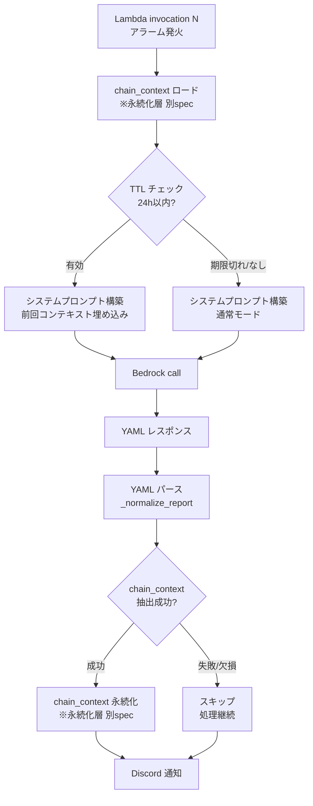

# LLM 出力チェーニング規約 — 技術設計

- **SPEC**: llm-output-chaining@0.1.0
- **rev**: 1

## 全体アーキテクチャ



## データ構造・スキーマ

### LLM 出力スキーマ（YAML）

```yaml
# 人間向けフィールド
summary: str           # 60文字以内、冒頭でパターン識別
severity: HIGH|MEDIUM|LOW
confidence: high|medium|low
pattern: A|B           # A=起動形跡なし / B=処理失敗
root_cause_hypothesis: str  # 200文字以内、優先順で複数仮説可
suggested_actions:
  - str                # 80文字以内、最大3件

# LLM to LLM 引き継ぎ専用（人間は読み飛ばしてよい）
chain_context:
  alarm_name: str
  fired_at: str        # ISO 8601
  pattern: A|B
  root_cause_summary: str   # 50文字以内
  key_technical_clues:
    - str              # 80文字以内、最大3件
  severity: HIGH|MEDIUM|LOW
  confidence: high|medium|low
```

### ChainContext 型定義（Python）

```python
from dataclasses import dataclass

@dataclass
class ChainContext:
    alarm_name: str
    fired_at: str       # ISO 8601
    pattern: str        # "A" or "B"
    root_cause_summary: str
    key_technical_clues: list[str]
    severity: str       # "HIGH" | "MEDIUM" | "LOW"
    confidence: str     # "high" | "medium" | "low"
```

## 処理フロー詳細

### 出力パース（REQ-001・REQ-003）

現在 `src/main.py:695-696` で行っている JSON decode を YAML パースに変更する。
`chain_context` の抽出・バリデーションは `src/utils/chain.py` に新設する。

```python
# src/utils/chain.py
import yaml
from dataclasses import dataclass, asdict

_REQUIRED_FIELDS = {"pattern", "root_cause_summary", "severity"}

def extract_chain_context(llm_response_text: str) -> ChainContext | None:
    try:
        data = yaml.safe_load(llm_response_text)
        ctx = data.get("chain_context") or {}
        if not _REQUIRED_FIELDS.issubset(ctx.keys()):
            return None
        return ChainContext(**ctx)
    except Exception:
        return None
```

### プロンプト埋め込み（REQ-004）

`render_prompt_system_base()` に `chain_context` 引数を追加し、存在する場合はプロンプト冒頭に埋め込む。

```python
# src/utils/prompt.py
import yaml
from dataclasses import asdict

def render_prompt_system_base(
    case_name: str,
    case_specific_instructions: str,
    chain_context: ChainContext | None = None,
) -> str:
    prefix = ""
    if chain_context:
        prefix = (
            "# 前回の解析結果\n"
            + yaml.dump(asdict(chain_context), allow_unicode=True, sort_keys=False)
            + "\n"
        )
    return prefix + _SYSTEM_PROMPT_TEMPLATE.format(
        case_name=case_name,
        case_specific_instructions=case_specific_instructions,
    )
```

### TTL チェック（REQ-005）

ロードした `chain_context` の `fired_at` と現在時刻を比較し、24 時間超過であれば `None` に差し替える。

```python
from datetime import datetime, timezone, timedelta

_TTL = timedelta(hours=24)

def validate_ttl(ctx: ChainContext | None) -> ChainContext | None:
    if ctx is None:
        return None
    try:
        fired_at = datetime.fromisoformat(ctx.fired_at)
        if datetime.now(timezone.utc) - fired_at > _TTL:
            return None
    except Exception:
        return None
    return ctx
```

## 技術判断・設計根拠

| 判断 | 選択 | 理由 |
|---|---|---|
| 出力フォーマット | YAML | JSON より人間可読性が高く LLM も安定出力できる。コメント記法でセクション意図を伝えられる |
| chain_context の位置 | 出力末尾 | 人間が読み飛ばしやすく、LLM の主推論フローに影響しにくい |
| 埋め込み位置 | システムプロンプト冒頭 | LLM がコンテキストを全体の前提として読める |
| 引き継ぎ世代数 | 1 世代のみ | コンテキスト膨張を防ぐ。複数世代は別 spec に先送り |
| 永続化手段 | 別 spec に委譲 | Lambda stateless 問題はストレージ選定が独立した関心事 |
| パース失敗時 | フォールバック（コンテキストなし継続） | LLM リトライよりレイテンシ・コストへの影響が小さい |

## 実装ガイド

### REQ-001・REQ-002: プロンプトのスキーマ定義更新

`src/utils/prompt.py` の `_SYSTEM_PROMPT_TEMPLATE` 内 `# 出力スキーマ` セクションを YAML 形式に書き換え、`chain_context` フィールドを追加する。

### REQ-003: YAML パースへの切り替え

`src/main.py:695-696` の JSON decode を `yaml.safe_load()` に変更。
`extract_chain_context()` を `src/utils/chain.py` に新設し、`main()` から呼び出す。

### REQ-004: プロンプト関数の拡張

`render_prompt_system_base()` に `chain_context` 引数を追加（後方互換のためデフォルト `None`）。

### REQ-005: TTL チェック

`validate_ttl()` を `src/utils/chain.py` に実装し、永続化層からロードした直後に呼び出す。

## 未解決事項（Open Decisions）

| ID | 内容 | 候補 | 現時点の方針 |
|---|---|---|---|
| O-1 | chain_context の永続化手段 | DynamoDB / SSM / S3 | 別 spec で定義 |
| O-2 | LLM が YAML を出力しない場合のリカバリ | リトライ / JSON フォールバック / スキップ | スキップ（コンテキストなし継続）を優先 |
